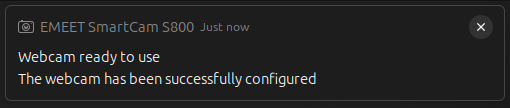
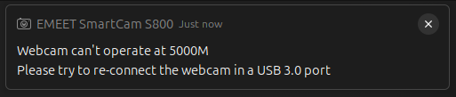

# 📷 Webcam Configurator for Linux

Configure your USB webcam automatically on Linux when it is connected.

This project installs:
- A command-line script at `/usr/local/bin/webcam-cfg`
- A JSON configuration file at `/etc/webcam-cfg.json`
- A udev rule at `/etc/udev/rules.d/99-webcam.rules`

When your webcam is plugged in, udev triggers `webcam-cfg`, which applies your configured format, resolution, and FPS using `v4l2-ctl`.

| Success Notification | Failure Notification |
|----------------------|----------------------|
|  |  |

## Requirements

The scripts require the following tools:
- `bash`
- `make`
- `jq`
- `v4l2-ctl` (from `v4l-utils`)
- `lsusb` (from `usbutils`)
- `notify-send` (from `libnotify` / `libnotify-bin`)
- `systemd-run` (from `systemd`)
- `udev` (for rules processing)

## Install Dependencies

### Debian / Ubuntu

```bash
sudo apt update
sudo apt install -y make jq v4l-utils usbutils libnotify-bin systemd
```

### Fedora

```bash
sudo dnf install -y make jq v4l-utils usbutils libnotify systemd
```

### Arch Linux

```bash
sudo pacman -S --needed make jq v4l-utils usbutils libnotify systemd
```

## Install the Program

From the project root, run:

```bash
make install
```

What `make install` does:
- Copies `config/webcam-cfg.json` to `/etc/webcam-cfg.json`
- Installs `scripts/webcam-cfg.sh` as `/usr/local/bin/webcam-cfg`
- Executes `scripts/udev-cfg.sh` to generate `/etc/udev/rules.d/99-webcam.rules`

## Configure `/etc/webcam-cfg.json`

Edit the configuration file:

```bash
sudo nano /etc/webcam-cfg.json
```

Example configuration:

```json
{
	"name": "EMEET SmartCam S800",
	"config": {
		"width": "1920",
		"height": "1080",
		"fps": "60",
		"format": "H264",
		"bandwidth": "5000M"
	}
}
```

Field reference:
- `name`: Webcam name as shown by `lsusb` and `v4l2-ctl --list-devices`
- `config.width`: Capture width (for example `1920`)
- `config.height`: Capture height (for example `1080`)
- `config.fps`: Target frames per second (for example `30` or `60`)
- `config.format`: Pixel format/fourcc (for example `H264` or `MJPG`)
- `config.bandwidth`: Expected USB link speed in `lsusb -v -t` output (for example `5000M` for USB 3.0)

Tip: use these commands to discover valid values:

```bash
lsusb
v4l2-ctl --list-devices
v4l2-ctl --device=/dev/video0 --list-formats-ext
lsusb -v -t
```

## Verify Installation

Reconnect your webcam, then check logs:

```bash
tail -n 100 /var/log/webcam-cfg.log
```

You can also run the script manually:

```bash
sudo /usr/local/bin/webcam-cfg
```

## Uninstall

```bash
make uninstall
```

Note: `make uninstall` removes only `/usr/local/bin/webcam-cfg`. Remove `/etc/webcam-cfg.json` and `/etc/udev/rules.d/99-webcam.rules` manually if needed.
